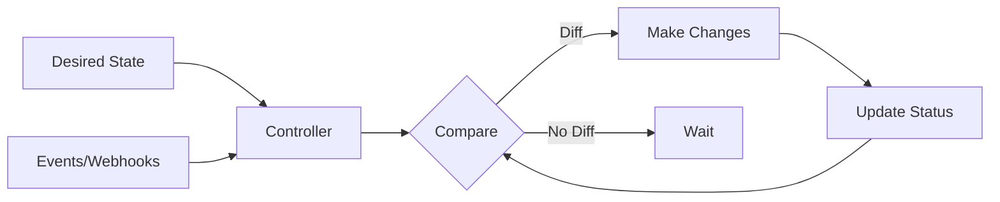

# The Reconciliation Loop

```mermaid
graph LR
    A[Desired State] --> B[Controller]
    G[Events/Webhooks] --> B
    B --> C{Compare}
    C -->|Diff| D[Make Changes]
    D --> E[Update Status]
    E --> C
    C -->|No Diff| F[Wait]
```

<v-clicks>

- Controllers continuously watch for changes
- Reconciliation ensures desired state
- Status updates track progress
- Event-driven architecture

</v-clicks>