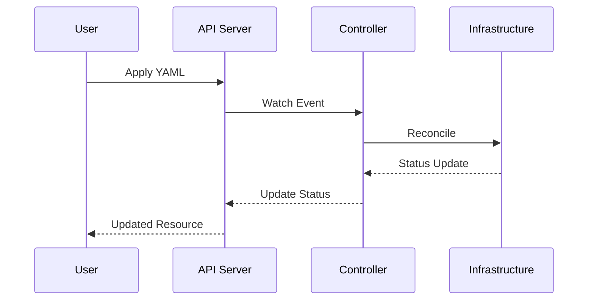

# Reconciliation Process

::left::

::right::

<v-clicks>

1. **Watch Phase**
   - Controllers watch Custom Resources
   - Events trigger reconciliation
   - Webhooks validate changes

2. **Reconciliation Phase**
   - Compare desired vs actual state
   - Plan necessary changes
   - Execute in order

</v-clicks>