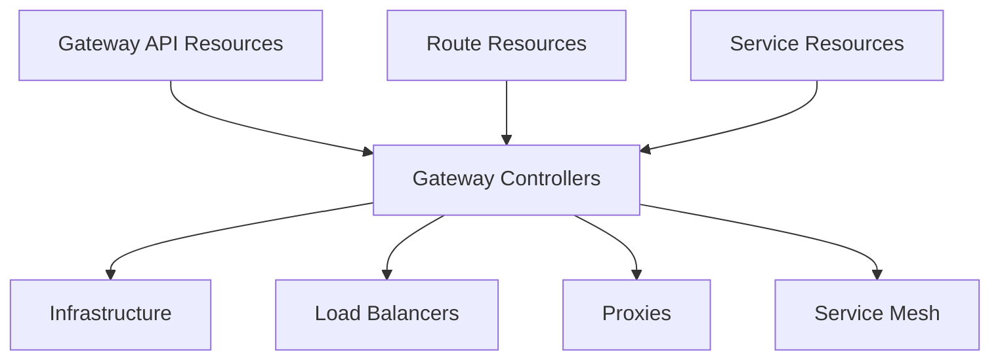

# Gateway API Architecture

## High-Level Overview

<v-click>

### Resource Layer
- Kubernetes Custom Resources
- Declarative configuration
- Role-based access control

</v-click>

<v-click>

### Controller Layer
- Multiple implementations
- Infrastructure specific
- Policy enforcement

</v-click>

<v-click>

### Infrastructure Layer
- Load balancers
- Proxies
- Service mesh components

</v-click>

