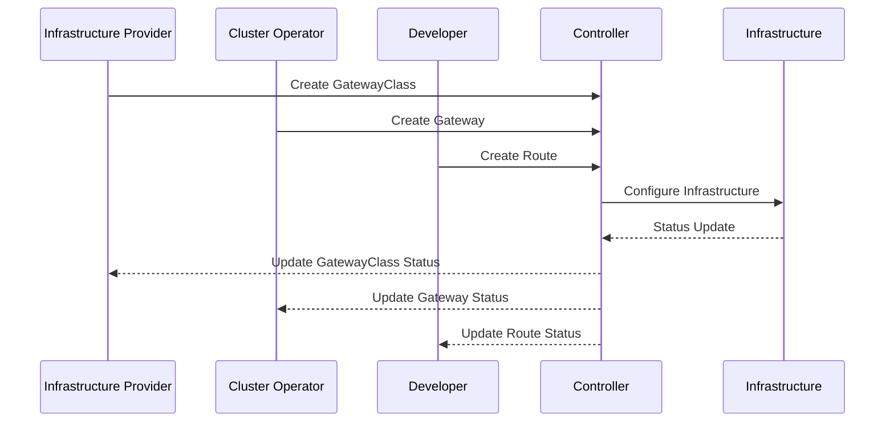

```yaml
layout: two-cols-header
layoutClass: gap-4
```

# Gateway API Components

::left::

<v-click>

### Gateway Controllers
- Traefik Gateway Controller
- Cilium Gateway Controller
- Istio Gateway Controller
- Contour Gateway Controller

</v-click>

<v-click>

### Route Controllers
- HTTP Route Controller
- GRPC Route Controller
- TCP Route Controller
- TLS Route Controller

</v-click>

::right::

<v-click>

### Policy Controllers
- BackendTLSPolicy
- ClientCertificatePolicy
- RateLimitPolicy

</v-click>

<v-click>

### Component Interaction

</v-click>
