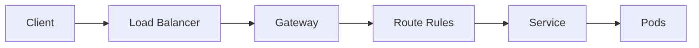

```yaml
layout: two-cols-header
layoutClass: gap-4
```

# Gateway API Workflow

## Request Flow



## Configuration Flow

::left::

<v-click>

### 1. Gateway Creation
- Define GatewayClass
- Configure Gateway
- Set up listeners
- Configure TLS

</v-click>

<v-click>

### 2. Route Configuration
- Create Route resources
- Define matching rules
- Configure backends

</v-click>

::right::

<v-click>

### 3. Policy Application
- Apply security policies
- Set up rate limiting

</v-click>

<v-click>

### 4. Status Updates
- Monitor Gateway status
- Track Route status
- Check policy compliance

</v-click>
