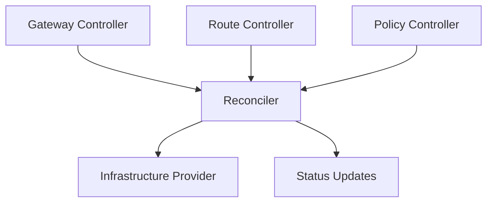

# Gateway API Controllers

## Controller Architecture

```mermaid {scale: 1}
graph TD
    A[Gateway Controller] --> B[Reconciler]
    B --> C[Infrastructure Provider]
    D[Route Controller] --> B
    E[Policy Controller] --> B
    B --> F[Status Updates]
```
